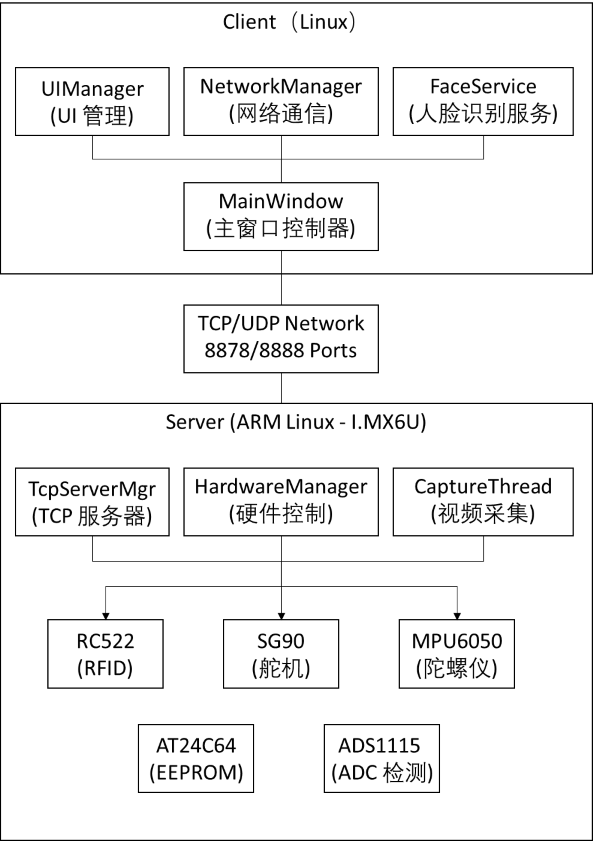
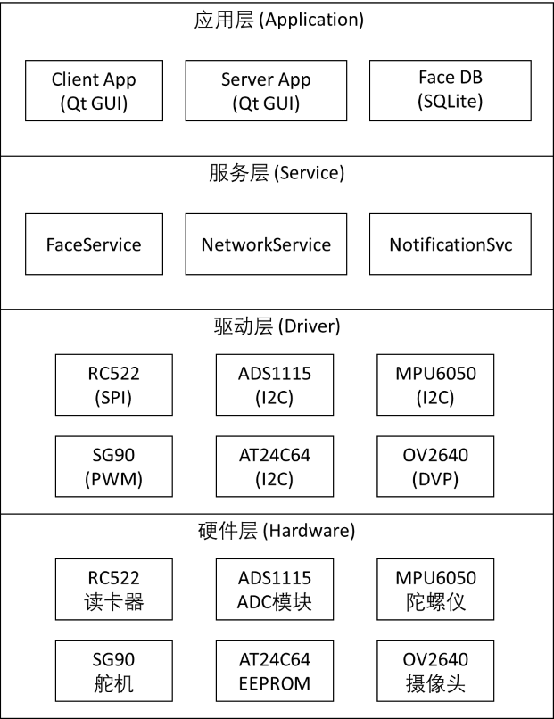
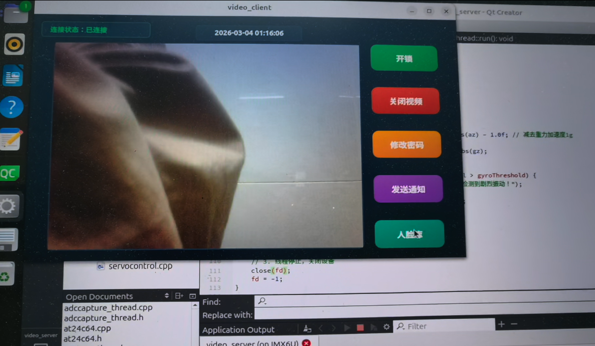
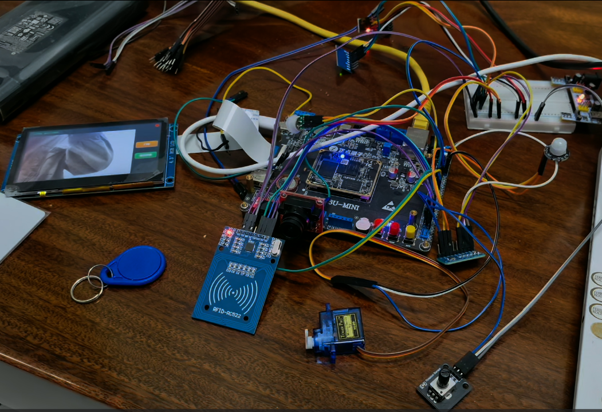
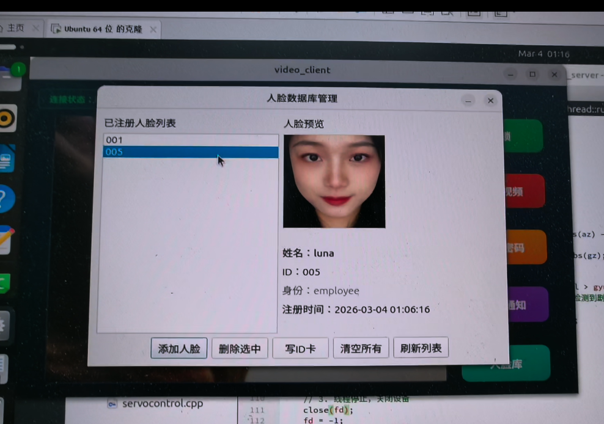
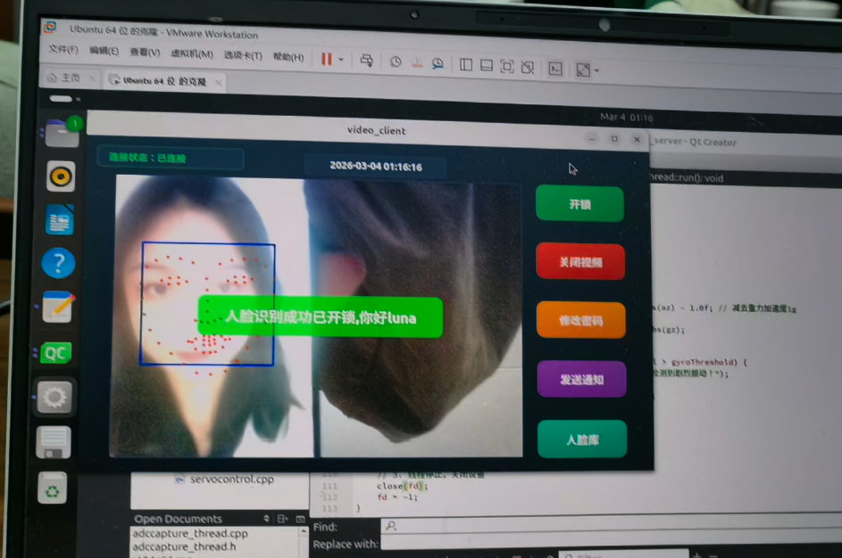

# VisionPass - 智能门禁系统

基于人脸识别与嵌入式硬件的智能门禁解决方案


---

## 项目简介

VisionPass 是一款集人脸识别、RFID 刷卡、密码验证、远程控制于一体的智能门禁系统。系统采用 C/S 架构，客户端运行于 Linux 桌面平台，服务端部署于嵌入式 ARM Linux 设备（正点原子 I.MX6U），实现安全、便捷、智能的出入门禁管理。

这个项目最初是在正点原子视频监控示例项目的基础上做二次开发的，我在原有功能之上逐步加入了人脸识别等相关模块，并计划后续继续往更智能化的方向完善。做这个项目的初衷，一方面是想通过实践提升自己在嵌入式与应用开发方面的能力，另一方面也是希望把它作为校招求职时的项目展示。整个项目前后大约做了四个月，基本是一边学习、一边查资料、一边动手实现。底层驱动部分参考了正点原子提供的代码和相关资料，应用层功能则主要由我自己完成。项目开发过程中我也适当借助了 AI 工具来辅助学习和优化，比如帮我梳理部分思路、检查一些实现细节，以及整理代码注释等，不过真正的功能实现、调试和问题解决还是得靠自己一点点去做，尤其是驱动相关的问题，很多都只能结合实际现象慢慢排查

演示视频：https://www.bilibili.com/video/BV1hgPDzpEjv/

由于上传文件大小限制，编译后的文件（包括人脸识别模型）放在了百度云盘上：https://pan.baidu.com/s/1e8YFIhWAW8UiVuQeatOYAA?pwd=1234 提取码: 1234

### 核心特性

- **无感通行**：人脸识别速度快
- **多重认证**：支持人脸、IC 卡、密码、远程开锁、物理旋钮五种方式
- **实时监控**：JPEG 编码 + Base64 传输 + UDP 广播
- **安全防护**：AES-128 加密通信，SHA-256 密码存储
- **边缘计算**：嵌入式端独立运行，断网仍可正常工作

---
## 系统架构

### 架构图



### 技术架构



---

## 功能特性与技术实现

### 客户端功能

#### 1. 实时视频监控
- **技术实现**: UDP 广播接收
- **协议**: UDP 协议（端口 8888）
- **数据格式**: JPEG 图像（Base64 编码）
- **帧率**: 15-20 FPS（640x480 分辨率）
- **延迟**: < 400ms（局域网环境）

#### 2. 人脸识别开锁
- **检测算法**: Dlib HOG + SVM 人脸检测
- **特征提取**: Dlib ResNet-34 深度学习模型（128 维特征向量）
- **匹配算法**: 欧氏距离比对（阈值 0.6）
- **识别速度**: < 500ms
- **多线程**: 独立人脸识别线程（QThread），生产者 - 消费者模式

#### 3. 人脸库管理
- **数据库**: SQLite 3.22
- **存储结构**: 
  - id (TEXT, 主键)
  - name (TEXT)
  - identity (TEXT)
  - descriptor (BLOB, 128 维浮点数组)
  - preview (BLOB, JPEG 预览图)
  - create_time (TIMESTAMP)
- **序列化**: QDataStream 序列化 Dlib 矩阵

#### 4. IC 卡绑定
- **写卡协议**: ISO14443A Type A
- **卡片类型**: Mifare Classic 1K (S50)
- **写入内容**: 用户 ID（4 字节）+ 姓名（16 字节）

#### 5. 密码修改
- **加密传输**: AES-128 加密后发送
- **存储方式**: SHA-256 哈希 + 随机盐值
- **密码规则**: 6-16 位数字或字母
- **验证流程**: 客户端加密 → 服务端解密 → 哈希比对

#### 6. 通知发送
- **协议**: TCP 自定义命令
- **格式**: 消息内容 + 显示时长
- **显示**: 服务端 OLED 屏幕显示
- **预设消息**: "外卖放门口"、"快递放门口"、"请不要敲门"等

#### 7. 远程开锁
- **协议**: TCP 命令帧
- **自动关锁**: 舵机 3 秒后自动复位

#### 8. 连接状态监控
- **心跳检测**: 每 5 秒发送心跳包
- **断线重连**: 指数退避算法（1s, 2s, 4s, 8s...）
- **状态显示**: 连接中/已连接/断开

### 服务端功能

#### 1. 视频采集推流
- **摄像头**: OV2640 摄像头（V4L2 驱动）
- **采集格式**: V4L2_PIX_FMT_RGB565，640x480
- **内存映射**: mmap 零拷贝技术
- **缓冲区**: 4 个循环缓冲区（VIDEO_BUFFER_COUNT）
- **推流协议**: UDP 广播（255.255.255.255:8888）
- **编码格式**: JPEG 编码 + Base64 传输

#### 2. 人脸检测
- **触发方式**: 红外感应自动启动
- **检测流程**: 
  1. 红外检测到人体靠近
  2. 启动摄像头采集
  3. 人脸检测（Dlib）
  4. 特征提取与比对
  5. 识别成功则开锁
- **休眠机制**: 无检测时自动休眠，降低功耗

#### 3. RFID 读卡
- **模块**: RC522（SPI 接口）
- **协议**: ISO14443A Type A（13.56MHz）
- **读卡频率**: 100ms 轮询一次
- **验证流程**:
  1. 读取卡片数据（ID+ 姓名）
  2. 查询 EEPROM 数据库
  3. 验证通过则开锁
  4. 记录开锁日志
- **写卡功能**: 支持将用户信息写入空白卡

#### 4. 密码验证
- **输入方式**: 虚拟键盘（Qt GUI）
- **验证流程**:
  1. 用户输入密码
  2. SHA-256 哈希计算
  3. 与 EEPROM 存储的哈希值比对
  4. 验证通过则开锁

#### 5. 舵机控制
- **型号**: SG90 舵机
- **接口**: PWM（脉宽调制）
- **控制逻辑**:
  - 0° - 锁门（舵机水平）
  - 90° - 开门（舵机垂直）
- **门磁检测**: ADC 检测门是否关闭（防止尾随）

#### 6. ADC 检测（ADS1115）
- **功能**: 检测门状态（开/关）、是否有人、以及旋钮的位置
- **型号**: ADS1115（16 位高精度 ADC，I2C 接口）
- **选择理由**: 
  - I.MX6U 可用接口太少，于是通过ADS1115模块进行扩展


#### 7. MPU6050 振动告警
- **传感器**: MPU6050 六轴陀螺仪（I2C 接口）
- **采样频率**: 5Hz（200ms 一次）
- **数据格式**:
  - 加速度：±2g（16 位，0.000122g/LSB）
  - 角速度：±250°/s（16 位，0.0305175°/s/LSB）
- **告警算法**:
  - 合加速度 = |ax|+|ay|+|az|-1.0g
  - 合角速度 = |gx|+|gy|+|gz|
  - 阈值：加速度 > 12.5g 或 角速度 > 500°/s
- **联动机制**: 仅门锁闭时启用振动检测

#### 8. EEPROM 存储
- **型号**: AT24C64（64Kbit，I2C 接口）
- **存储内容**:
  - 用户信息（ID+ 姓名）
  - 密码哈希（SHA-256，32 字节）
  - 加密密钥（AES-128，16 字节）
  - 系统参数（IP 地址、端口等）
- **分区管理**: 用户区、密钥区、参数区
- **掉电保护**: 关键数据实时写入

---
## 演示截图


### 客户端界面


### 服务端设备


### 人脸识别演示



---


## 未来规划

### 1. 云端集成
- **MQTT 日志上传**：通过 MQTT 协议将开锁记录、告警信息等日志上传到云端服务器
- **云存储**：日志数据持久化存储，支持历史记录查询和分析
- **远程监控**：通过云端平台实时监控门禁状态

### 2. 移动端控制
- **手机 APP 控制**：开发 Android 应用，实现远程开锁功能
- **密码管理**：支持通过手机修改门禁密码
- **临时密码**：生成一次性临时密码，支持时效性管理
- **推送通知**：接收门禁状态变更、告警信息等推送通知

### 3. 硬件联动
- **SORA 模块集成**：通过 SORA 模块与 STM32 单片机建立通信
- **个性化联动**：针对不同用户开锁，STM32 单片机执行不同预设动作（如灯光控制、空调调节等）
- **多传感器扩展**：增加温湿度、烟雾、人体感应等传感器，实现更丰富的智能家居联动

### 4. AI 智能分析
- **行为分析**：基于历史开锁记录，分析用户行为模式
- **异常检测**：通过 AI 算法识别异常开锁行为，及时发出告警
- **预测性维护**：基于设备运行数据，预测硬件故障并提前预警

---


## 技术栈与选型理由

### 客户端技术

| 类别 | 技术 | 版本 | 用途 | 选型理由 |
|-----|------|------|------|---------|
| **开发框架** | Qt | 5.12 | GUI 框架、网络通信 | **跨平台**（Windows/Linux）、**信号槽机制**简化多线程编程、**丰富的 UI 控件**、**网络模块完善**（QTcpSocket/QUdpSocket） |
| **编程语言** | C++ | 17 | 核心逻辑实现 | **性能优异**（适合实时处理）、**面向对象**（代码组织清晰）、**STL 库丰富**、**与 Qt 完美集成** |
| **计算机视觉** | OpenCV | 3.1 | 图像处理、人脸检测 | **开源免费**、**性能优化好**、**算法丰富**（人脸检测、图像处理）、**社区活跃** |
| **深度学习** | Dlib | 19.24 | 人脸识别、特征提取 | **预训练模型**（ResNet-34）、**API 简洁**、**C++ 实现**（性能好）、**128 维特征向量**（识别准确） |
| **数据库** | SQLite | 3.22 | 人脸特征存储 | **零配置**（无需安装服务器）、**单文件**（便于部署）、**ACID 事务**（数据安全）、**Qt 内置支持** |
| **加密算法** | AES-128 | 自实现 | 视频流、密码加密 | **对称加密**（速度快）、**128 位密钥**（安全性足够）、**开源实现** |

### 服务端技术

| 类别 | 技术 | 版本 | 用途 | 选型理由 |
|-----|------|------|------|---------|
| **开发框架** | Qt | 5.12 | 事件驱动、网络服务 | **跨平台**（ARM Linux）、**事件驱动**（适合 IO 密集型）、**网络模块完善**、**多线程支持好** |
| **嵌入式平台** | ARM Cortex-A7 | I.MX6U | 主控制器 | **性能足够**（双核 1GHz）、**接口丰富**（I2C/SPI/PWM）、**功耗低**（适合嵌入式）、**教学资料详细**（正点原子） |
| **操作系统** | Linux | 4.1.15 | 嵌入式 Linux | **开源免费**、**驱动完善**（V4L2/I2C/SPI）、**实时性好**、**社区支持强** |
| **硬件接口** | I2C/PWM/SPI | - | 传感器通信 | **标准接口**（芯片都支持）、**驱动简单**（Linux 内核支持）、**稳定可靠** |
| **视频采集** | V4L2 | - | 摄像头驱动 | **Linux 标准**（所有摄像头支持）、**零拷贝**（mmap 高效）、**开源驱动** |

### 硬件驱动

| 驱动 | 接口 | 协议 | 源码位置 | 选型理由 |
|------|------|------|---------|---------|
| **RC522 RFID** | SPI | ISO14443A | driver/rc522/ | **成本低**（10 元）、**协议成熟**（门禁常用）、**SPI 接口**（速度快）、**文档完善** |
| **SG90 舵机** | PWM | - | driver/sg90/ | **成本低**（5 元）、**控制简单**（PWM 占空比） |
| **AT24C64 EEPROM** | I2C | I2C | 系统自带驱动 | **掉电不丢失**（存储用户数据）、**I2C 接口**（接线简单）、**容量足够**（8KB）、**便宜**（2 元） |
| **MPU6050 陀螺仪** | I2C | I2C | driver/mpu6050/ | **六轴集成**（加速度 + 陀螺仪）、**精度高**（16 位）、**I2C 接口**（简单）、**便宜**（15 元） |
| **ADS1115 ADC** | I2C | I2C | driver/ads1115/ | **16 位高精度**（内置 ADC 只有 12 位）、**I2C 接口**（省 GPIO） |
| **OV2640 摄像头** | DVP | V4L2 | 系统自带驱动 |**V4L2 驱动**（Linux 标准）、**640x480**（满足需求）、**便宜**（30 元） |

---


## 安全特性

### 通信安全

- **AES-128 加密**: 密码等敏感数据加密传输
- **TCP 长连接**: 心跳检测，断线自动重连
- **数据校验**: PKCS#7 填充，防止数据篡改

### 存储安全

- **SHA-256 哈希**: 密码加盐哈希存储
- **EEPROM 分区**: 用户数据、密钥、参数分区存储
- **掉电保护**: 关键数据实时写入 EEPROM

### 访问控制

- **阈值控制**: 人脸识别距离阈值 0.6，可调节
- **防尾随设计**: ADC 检测门状态，防止尾随进入
- **振动告警**: MPU6050 检测暴力破坏

---

## 项目结构

```
VisionPass/
├── video_client/              # 客户端源码
│   ├── mainwindow.cpp/h       # 主窗口实现
│   ├── faceservice.cpp/h      # 人脸识别服务
│   ├── networkmanager.cpp/h   # 网络管理
│   ├── uimanager.cpp/h        # UI 管理
│   ├── facerecognizerthread.h # 人脸识别线程
│   ├── facedbmanager.cpp/h    # 人脸库管理
│   ├── configmanager.cpp/h    # 配置管理
│   └── video_client.pro       # Qt 项目文件
│
├── video_server/              # 服务端源码
│   ├── mainwindow.cpp/h       # 主窗口实现
│   ├── tcpservermanager.cpp/h # TCP 服务器管理
│   ├── hardwaremanager.cpp/h  # 硬件管理
│   ├── capture_thread.cpp/h   # 视频采集线程
│   ├── notificationservice.cpp/h # 通知服务
│   ├── rc522.cpp/h            # RFID 驱动
│   ├── at24c64.cpp/h          # EEPROM 驱动
│   ├── servocontrol.cpp/h     # 舵机控制
│   ├── mpu6050_thread.cpp/h   # 陀螺仪线程
│   └── video_server.pro       # Qt 项目文件
│
├── driver/                    # 硬件驱动源码
│   ├── rc522/                 # RC522 RFID 驱动
│   │   ├── rc522.c
│   │   ├── rc522.h
│   │   └── Makefile
│   ├── sg90/                  # SG90 舵机驱动
│   │   ├── sg90_driver.c
│   │   └── Makefile
│   ├── mpu6050/               # MPU6050 陀螺仪驱动
│   │   ├── my_6050.c
│   │   ├── my_6050.h
│   │   └── Makefile
│   ├── ads1115/               # ADS1115 ADC 驱动
│   │   ├── my_ads1115.c
│   │   └── Makefile
│
├── build-video_client-*/      # 客户端编译输出
├── build-video_server-*/      # 服务端编译输出
└── README.md                  # 项目文档
```

---

## 快速开始

### 环境要求

#### 客户端（Linux）

- **操作系统**: Ubuntu 18.04+ / Debian 10+
- **Qt 版本**: Qt 5.12+
- **编译器**: GCC 7.5+
- **依赖库**:
  - OpenCV 3.1+
  - Dlib 19.24+
  - SQLite 3.x

#### 服务端（嵌入式）

- **硬件平台**: 正点原子 I.MX6U (ARM Cortex-A7)
- **操作系统**: Embedded Linux 4.1.15
- **交叉编译器**: arm-linux-gnueabihf-gcc 4.9+
- **依赖库**:
  - Qt for ARM
  - OpenCV 3.1 


### 配置说明

#### 客户端配置 (config.ini)
（人脸识别的模型需要放在编译输出目录下，config.ini也需要放在编译输出目录下）
```ini
[FaceRecognition]
landmark_model=shape_predictor_68_face_landmarks.dat
recognition_model=dlib_face_recognition_resnet_model_v1.dat

[Network]
server_ip=192.168.3.15
tcp_port=8878
```

#### 服务端设备树配置（Device Tree）

嵌入式端需要配置设备树以启用相关硬件接口。设备树文件位于 `arch/arm/boot/dts/imx6ull-14x14-evk.dts`。

##### 1. I2C1 接口配置（用于 ADS1115、MPU6050）

```dts
&i2c1 {
    clock-frequency = <100000>;  // I2C 时钟频率 100kHz
    pinctrl-names = "default";
    pinctrl-0 = <&pinctrl_i2c1>;
    status = "okay";

    // ADS1115 ADC 配置
    ads1115@48 {
        compatible = "ti,ads1115";  // 驱动匹配关键字
        reg = <0x48>;               // I2C 设备地址 0x48
    };

    // MPU6050 陀螺仪配置
    my_mpu6050@68 {
        compatible = "my_mpu6050";
        reg = <0x68>;  // I2C 地址 0x68
    };
};

// I2C1 引脚配置
pinctrl_i2c1: i2c1grp {
    fsl,pins = <
        MX6UL_PAD_UART4_TX_DATA__I2C1_SCL 0x4001b8b0
        MX6UL_PAD_UART4_RX_DATA__I2C1_SDA 0x4001b8b0
    >;
};
```

##### 2. SPI3 接口配置（用于 RC522 RFID）

```dts
&ecspi3 {
    fsl,spi-num-chipselects = <1>;
    cs-gpio = <&gpio1 20 GPIO_ACTIVE_LOW>;  // 片选引脚 GPIO1_IO20
    pinctrl-names = "default";
    pinctrl-0 = <&pinctrl_ecspi3>;
    status = "okay";

    // RC522 RFID 配置
    spi_device: rc522@0 {
        compatible = "alientek,rc522";
        spi-max-frequency = <8000000>;  // 最大 8MHz
        reg = <0>;  // 片选 0
    };
};

// SPI3 引脚配置
pinctrl_ecspi3: ecspi3grp {
    fsl,pins = <
        MX6UL_PAD_UART2_RTS_B__ECSPI3_MISO 0x10b1  // MISO 引脚
        MX6UL_PAD_UART2_CTS_B__ECSPI3_MOSI 0x10b1  // MOSI 引脚
        MX6UL_PAD_UART2_RX_DATA__ECSPI3_SCLK 0x10b1 // SCLK 引脚
        MX6UL_PAD_UART2_TX_DATA__GPIO1_IO20 0x10b0  // CS 引脚
    >;
};
```


##### 3. PWM3 接口配置（用于 SG90 舵机）

```dts
&pwm3 {
    pinctrl-names = "default";
    pinctrl-0 = <&pinctrl_pwm3>;
    clocks = <&clks IMX6UL_CLK_PWM3>, <&clks IMX6UL_CLK_PWM3>;
    status = "okay";
};

// PWM3 引脚配置
pinctrl_pwm3: pwm2grp {
    fsl,pins = <
        MX6UL_PAD_GPIO1_IO04__PWM3_OUT 0x110b0
    >;
};
```

##### 4. 摄像头配置（用于 OV2640）

```dts
// CSI 接口使能
&csi {
    status = "okay";
    port {
        csi_ep: endpoint {
            remote-endpoint = <&camera_ep>;
        };
    };
};

// OV2640 摄像头配置
#if ATK_CAMERA_ON
ov2640: camera@0x30 {
    compatible = "ovti,ov2640";
    reg = <0x30>;
    status = "okay";
    
    pinctrl-names = "default";
    pinctrl-0 = <&pinctrl_csi1 &csi_pwn_rst>;
    resetb = <&gpio1 2 GPIO_ACTIVE_LOW>;  // 复位引脚 GPIO1_IO02
    pwdn = <&gpio1 6 GPIO_ACTIVE_HIGH>;   // 功耗控制引脚 实际上这里直接接地就行
    
    clocks = <&clks IMX6UL_CLK_CSI>;
    clock-names = "xvclk";
    
    port {
        camera_ep: endpoint {
            remote-endpoint = <&csi_ep>;
            bus-width = <8>;  // 8 位数据总线
        };
    };
};
#endif

// CSI 引脚配置
pinctrl_csi1: csi1grp {
    fsl,pins = <
        MX6UL_PAD_CSI_MCLK__CSI_MCLK      0x1b088  // 主时钟
        MX6UL_PAD_CSI_PIXCLK__CSI_PIXCLK  0x1b088  // 像素时钟
        MX6UL_PAD_CSI_VSYNC__CSI_VSYNC    0x1b088  // 场同步
        MX6UL_PAD_CSI_HSYNC__CSI_HSYNC    0x1b088  // 行同步
        MX6UL_PAD_CSI_DATA00__CSI_DATA02  0x1b088  // 数据位 2
        MX6UL_PAD_CSI_DATA01__CSI_DATA03  0x1b088  // 数据位 3
        MX6UL_PAD_CSI_DATA02__CSI_DATA04  0x1b088  // 数据位 4
        MX6UL_PAD_CSI_DATA03__CSI_DATA05  0x1b088  // 数据位 5
        MX6UL_PAD_CSI_DATA04__CSI_DATA06  0x1b088  // 数据位 6
        MX6UL_PAD_CSI_DATA05__CSI_DATA07  0x1b088  // 数据位 7
        MX6UL_PAD_CSI_DATA06__CSI_DATA08  0x1b088  // 数据位 8
        MX6UL_PAD_CSI_DATA07__CSI_DATA09  0x1b088  // 数据位 9
    >;
};
```


---


## 作者

**Lu Yaolong - Ocean University of China**

---

## 致谢

感谢以下开源项目：

- [Qt](https://www.qt.io/) - 跨平台 GUI 框架
- [OpenCV](https://opencv.org/) - 开源计算机视觉库
- [Dlib](http://dlib.net/) - 机器学习库
- [libfacedetection](https://github.com/ShiqiYu/libfacedetection) - 人脸检测库


---

如果这个项目对你有帮助，请给一个 Star 支持！

Made with care by Lu Yaolong


